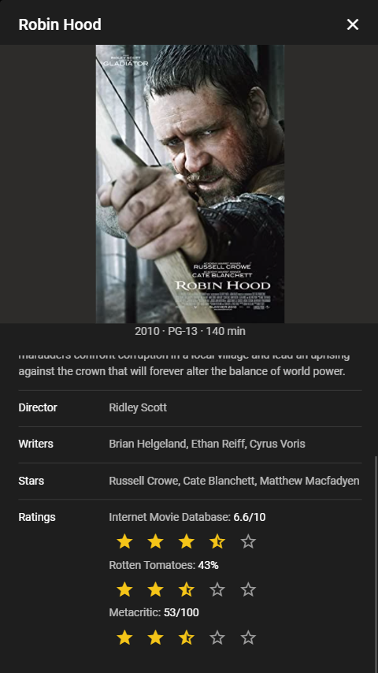

<div style="text-align: center;">
  <h1>🎬 Movie database 🎬</h1>
  <strong>A movie database webapp built using Vue.js and Vuetify and backed by Open Movie DataBase API.</strong><br/>
  <p>
    
  </p>
  <p>
  Movie database is a sample webapp built with <a href="https://vuejs.org/">Vue.js</a> and <a href="https://vuetifyjs.com/">Vuetify</a> as a frontend to the <a href="https://omdbapi.com/">Open Movie DataBase API</a>. It is designed as a responsive webapp and supports theming and dark mode.
  </p>
  <p>
    
  </p>
</div>

### 🌙 Dark Mode

This project supports "dark mode" styling, and by default it will follow the color preference on your device. It also allows for overriding this using buttons at the top right of the screen, which will persist the preference to local storage on your device. More info about color preference web API's can be found here: [MDN Web Docs](https://developer.mozilla.org/en-US/docs/Web/CSS/@media/prefers-color-scheme).
<div style="text-align: center">
  <p>
    
  </p>
  <p>
    
  </p>
</div>

### 📱 Responsive Design

This webapp is built using responsive design in mind, and by default it will adjust its content depending on the screen size of the medium (e.g. phone/computer). More info about color preference web API's can be found here: [MDN Web Docs](https://developer.mozilla.org/en-US/docs/Learn/CSS/CSS_layout/Responsive_Design).
<div style="text-align: center;">
  <table style="border: 0px;">
    <tr>
      <td></td>
      <td></td>
    </tr>
  </table>
</div>

## 📖 Project setup
To setup for development, checkout the project and run:
```sh
# Installs dependencies
npm install
```

### 🖥️ Local development
```sh
# Compiles and hot-reloads for development
npm run serve
```

### 🧪 Testing and linting
```sh
# Lints and fixes files
npm run lint
```

### 📦 Building for production
```sh
# Compiles and minifies for production
npm run build
```

### Customize configuration
See [Configuration Reference](https://cli.vuejs.org/config/).
